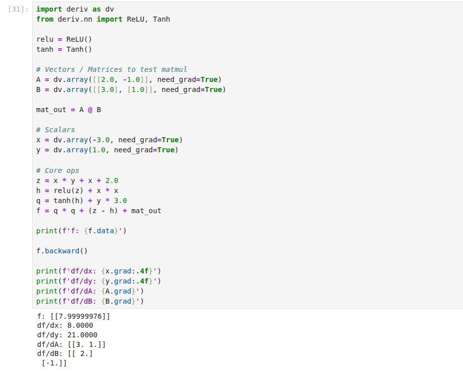

# deriv

deriv is a lightweight automatic differentiation library with a NumPy-like API and a minimal neural network framework. It is designed for clarity, extensibility, and low-level control over training loops and operations.

> This is an early alpha release. APIs may change.

---
## Features
- Reverse-mode autodiff from scratch

- NumPy-like API and syntax

- Basic neural layers: Dense, ReLU, Tanh

- Custom optimizer support

- Pure Python with minimal dependencies

---
## Installation

```bash
pip install git+https://github.com/kandarpa02/py-deriv.git
```

---
## Minimal Training Example

```python
import deriv
from deriv.nn import dense, ReLU
from deriv.optim import SGD
from deriv import array

# Define a simple model
class MLP:
    def __init__(self):
        self.fc1 = dense(2, 4)
        self.act = ReLU()
        self.fc2 = dense(4, 1)

    def __call__(self, x):
        x = self.fc2(self.act(self.fc1(x)))
        return x

# Training loop
model = MLP()
opt = SGD(parameters=model.fc1.parameters() | model.fc2.parameters(), lr=0.1)

x = array([[1.0, 2.0]])
y = array([[1.0]])

for epoch in range(20):
    pred = model(x)
    loss = ((pred - y) ** 2).sum()

    loss.backward()
    opt.step()
    opt.zero_grad()

    print(f"{loss.data:.6f}")

```
Now let us visualize the computation graph:

```python
loss.graph(data=True)
```
```bash
└── sum (0.06405178670339864)
    └── ** ([[0.06405179]])
        ├── - ([[0.25308454]])
        │   ├── + ([[1.25308454]])
        │   │   ├── @ ([[-0.00857591]])
        │   │   │   ├── relu ([[0.         0.         0.06267745 0.        ]])
        │   │   │   │   └── + ([[-0.09848323 -0.3190433   0.06267745 -0.19315135]])
        │   │   │   │       ├── @ ([[-0.09848323 -0.3190433   0.06267745 -0.19315135]])
        │   │   │   │       │   ├── x ([[1. 2.]])
        │   │   │   │       │   └── fc1w ([[-0.00275869  0.02477053 -0.10098853 -0.05753474]
 [-0.04786227 -0.17190691  0.08183299 -0.0678083 ]])
        │   │   │   │       └── fc1b ([0. 0. 0. 0.])
        │   │   │   └── fc2w ([[ 0.00422861]
 [ 0.11447357]
 [-0.13539546]
 [ 0.09376934]])
        │   │   └── fc2b ([1.28448639])
        │   └── y ([[1.]])
        └──  (2)
```

<details>
<summary>Sample Output</summary>

```bash
1.027248
0.986411
0.911882
0.812378
0.697190
0.575332
0.454885
0.342529
0.243282
0.160409
0.095492
0.048606
0.018591
0.003353
0.000192
0.006111
0.018085
0.033292
0.049274
0.064052
```
</details>

## Autodiff in Action

Here's a sample forward and backward pass using Deriv:



The above code computes a composite function:

```
z = xy + x + 2 
h = ReLU(z) + x^2 
q = tanh(h) + 3y
f = q^2 + (z - h) + (A @ B)
```

Where:
- x = -3
- y = 1
- A = [2, -1]
- B = [[3], [1]]


This produces:
```
f = 8.0
df/dx = 42.0000
df/dy = -3.0000
df/dA = [3.0, 1.0]
df/dB = [[2.0], [-1.0]]
```

> Deriv handles broadcasting, ReLU/Tanh activation, matrix multiplication, and complex chaining — all from scratch.

---

## Disclaimer

Still under heavy development. Expect breaking changes. For now it only works on CPU.

its a test